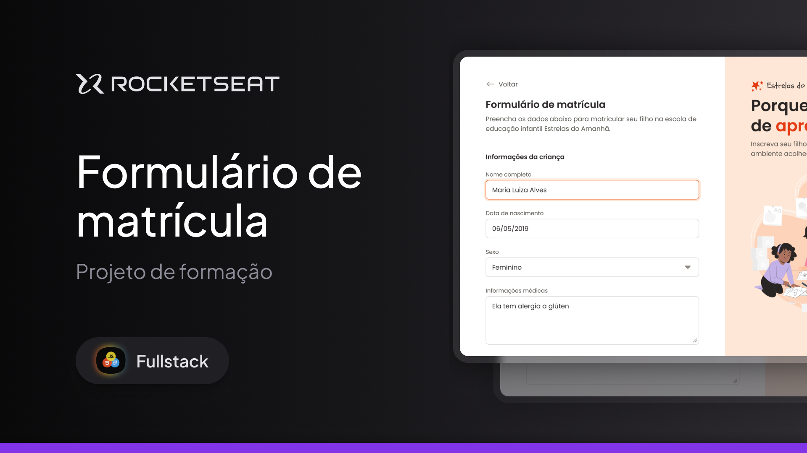

  

Projeto de um Formulário de matrícula desenvolvido durante as aulas sobre Formulários na Rocketseat.

  <a href="#-tecnologias">Tecnologias</a>&nbsp;&nbsp;&nbsp;|&nbsp;&nbsp;&nbsp;
  <a href="#-projeto">Projeto</a>

 

  

## 🚀 Tecnologias

Esse projeto foi desenvolvido com as seguintes tecnologias:

- HTML
- CSS

## Projeto

Nesse projeto desenvolvemos um Formulário de matrícula para uma escola de educação infantil.
Trabalhei com diversos tipos de input além de rever e treinar bastante o CSS.
